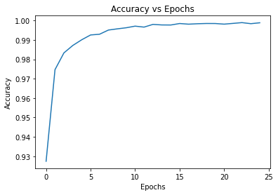
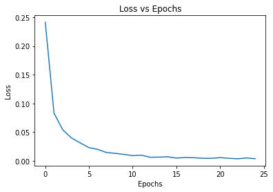
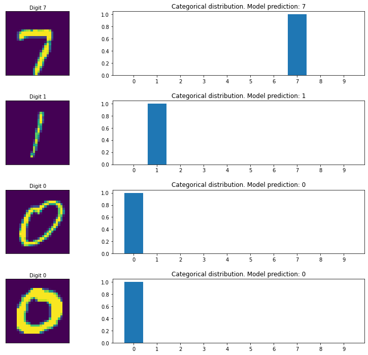

## CNN classifier for the MNIST dataset

### Instructions

Build, compile and fit a convolutional neural network (CNN) model to the MNIST dataset of images of handwritten digits.


```python
#### PACKAGE IMPORTS ####

import tensorflow as tf
import pandas as pd
import numpy as np
import matplotlib.pyplot as plt
%matplotlib inline

# If you would like to make further imports from Tensorflow, add them here
from tensorflow.keras.models import Sequential
from tensorflow.keras.layers import Dense, Flatten, Conv2D, MaxPooling2D
from tensorflow.keras.preprocessing import image
```

#### The MNIST dataset

Use the [MNIST dataset](http://yann.lecun.com/exdb/mnist/). It consists of a training set of 60,000 handwritten digits with corresponding labels, and a test set of 10,000 images. The images have been normalised and centred. The dataset is frequently used in machine learning research, and has become a standard benchmark for image classification models. 

- Y. LeCun, L. Bottou, Y. Bengio, and P. Haffner. "Gradient-based learning applied to document recognition." Proceedings of the IEEE, 86(11):2278-2324, November 1998.

Construct a neural network that classifies images of handwritten digits into one of 10 classes.

#### Load and preprocess the data


```python
# Run this cell to load the MNIST data

mnist_data = tf.keras.datasets.mnist
(train_images, train_labels), (test_images, test_labels) = mnist_data.load_data()
```

    Downloading data from https://storage.googleapis.com/tensorflow/tf-keras-datasets/mnist.npz
    11493376/11490434 [==============================] - 0s 0us/step
    

First, preprocess the data by scaling the training and test images so their values lie in the range from 0 to 1.


```python

def scale_mnist_data(train_images, test_images):
    """
    This function takes in the training and test images as loaded in the cell above, and scales them
    so that they have minimum and maximum values equal to 0 and 1 respectively.
    Your function should return a tuple (train_images, test_images) of scaled training and test images.
    """
    train_images = train_images/255
    test_images = test_images/255
    return (train_images, test_images)
    
```


```python
# Run your function on the input data

scaled_train_images, scaled_test_images = scale_mnist_data(train_images, test_images)
```


```python
# Add a dummy channel dimension

scaled_train_images = scaled_train_images[..., np.newaxis]
scaled_test_images = scaled_test_images[..., np.newaxis]
```

#### Build the convolutional neural network model

We are now ready to construct a model to fit to the data. Using the Sequential API, build your CNN model according to the following spec:

* The model should use the `input_shape` in the function argument to set the input size in the first layer.
* A 2D convolutional layer with a 3x3 kernel and 8 filters. Use 'SAME' zero padding and ReLU activation functions. Make sure to provide the `input_shape` keyword argument in this first layer.
* A max pooling layer, with a 2x2 window, and default strides.
* A flatten layer, which unrolls the input into a one-dimensional tensor.
* Two dense hidden layers, each with 64 units and ReLU activation functions.
* A dense output layer with 10 units and the softmax activation function.

In particular, your neural network should have six layers.


```python

def get_model(input_shape):
    """
    This function should build a Sequential model according to the above specification. Ensure the 
    weights are initialised by providing the input_shape argument in the first layer, given by the
    function argument.
    Your function should return the model.
    """
    model = Sequential(
        [
            Conv2D(filters=8, kernel_size=3,
                   padding='SAME',
                   activation='relu',
                   input_shape=input_shape),
            MaxPooling2D((2,2)),
            Flatten(),
            Dense(64, activation='relu'),
            Dense(64, activation='relu'),
            Dense(10, activation='softmax')
        ])
    return model
    
```


```python
# Run your function to get the model

model = get_model(scaled_train_images[0].shape)
```

#### Compile the model

You should now compile the model using the `compile` method. To do so, you need to specify an optimizer, a loss function and a metric to judge the performance of your model.


```python

def compile_model(model):
    """
    This function takes in the model returned from your get_model function, and compiles it with an optimiser,
    loss function and metric.
    Compile the model using the Adam optimiser (with default settings), the cross-entropy loss function and
    accuracy as the only metric. 
    Your function doesn't need to return anything; the model will be compiled in-place.
    """
    model.compile(loss='sparse_categorical_crossentropy',
              optimizer='adam',
              metrics=['accuracy'])
    
    return model
    
```


```python
# Run your function to compile the model

compile_model(model)
```


    <tensorflow.python.keras.engine.sequential.Sequential at 0x7fc356c74050>


#### Fit the model to the training data

Now you should train the model on the MNIST dataset, using the model's `fit` method. Set the training to run for 5 epochs, and return the training history to be used for plotting the learning curves.


```python

def train_model(model, scaled_train_images, train_labels):
    """
    This function should train the model for 15 epochs on the scaled_train_images and train_labels. 
    Your function should return the training history, as returned by model.fit.
    """
    history = model.fit(scaled_train_images, train_labels, epochs=25)
    
    return history
    
```


```python
# Run your function to train the model

history = train_model(model, scaled_train_images, train_labels)
```

    Epoch 1/25
    1875/1875 [==============================] - 36s 2ms/step - loss: 0.4367 - accuracy: 0.8698
    Epoch 2/25
    1875/1875 [==============================] - 4s 2ms/step - loss: 0.0871 - accuracy: 0.9735
    Epoch 3/25
    1875/1875 [==============================] - 4s 2ms/step - loss: 0.0545 - accuracy: 0.9828
    Epoch 4/25
    1875/1875 [==============================] - 4s 2ms/step - loss: 0.0391 - accuracy: 0.9873
    Epoch 5/25
    1875/1875 [==============================] - 4s 2ms/step - loss: 0.0291 - accuracy: 0.9904
    Epoch 6/25
    1875/1875 [==============================] - 4s 2ms/step - loss: 0.0216 - accuracy: 0.9930
    Epoch 7/25
    1875/1875 [==============================] - 4s 2ms/step - loss: 0.0178 - accuracy: 0.9939
    Epoch 8/25
    1875/1875 [==============================] - 4s 2ms/step - loss: 0.0120 - accuracy: 0.9960
    Epoch 9/25
    1875/1875 [==============================] - 4s 2ms/step - loss: 0.0129 - accuracy: 0.9954
    Epoch 10/25
    1875/1875 [==============================] - 4s 2ms/step - loss: 0.0085 - accuracy: 0.9972
    Epoch 11/25
    1875/1875 [==============================] - 4s 2ms/step - loss: 0.0087 - accuracy: 0.9974
    Epoch 12/25
    1875/1875 [==============================] - 4s 2ms/step - loss: 0.0076 - accuracy: 0.9975
    Epoch 13/25
    1875/1875 [==============================] - 4s 2ms/step - loss: 0.0045 - accuracy: 0.9988
    Epoch 14/25
    1875/1875 [==============================] - 4s 2ms/step - loss: 0.0061 - accuracy: 0.9981
    Epoch 15/25
    1875/1875 [==============================] - 4s 2ms/step - loss: 0.0056 - accuracy: 0.9982
    Epoch 16/25
    1875/1875 [==============================] - 4s 2ms/step - loss: 0.0041 - accuracy: 0.9987
    Epoch 17/25
    1875/1875 [==============================] - 4s 2ms/step - loss: 0.0059 - accuracy: 0.9982
    Epoch 18/25
    1875/1875 [==============================] - 4s 2ms/step - loss: 0.0036 - accuracy: 0.9990
    Epoch 19/25
    1875/1875 [==============================] - 4s 2ms/step - loss: 0.0039 - accuracy: 0.9988
    Epoch 20/25
    1875/1875 [==============================] - 5s 2ms/step - loss: 0.0043 - accuracy: 0.9984
    Epoch 21/25
    1875/1875 [==============================] - 4s 2ms/step - loss: 0.0041 - accuracy: 0.9984
    Epoch 22/25
    1875/1875 [==============================] - 4s 2ms/step - loss: 0.0027 - accuracy: 0.9991
    Epoch 23/25
    1875/1875 [==============================] - 4s 2ms/step - loss: 0.0025 - accuracy: 0.9992
    Epoch 24/25
    1875/1875 [==============================] - 4s 2ms/step - loss: 0.0046 - accuracy: 0.9985
    Epoch 25/25
    1875/1875 [==============================] - 4s 2ms/step - loss: 0.0022 - accuracy: 0.9993
    

#### Plot the learning curves

We will now plot two graphs:
* Epoch vs accuracy
* Epoch vs loss

We will load the model history into a pandas `DataFrame` and use the `plot` method to output the required graphs.


```python
# Run this cell to load the model history into a pandas DataFrame

frame = pd.DataFrame(history.history)
```


```python
# Run this cell to make the Accuracy vs Epochs plot

acc_plot = frame.plot(y="accuracy", title="Accuracy vs Epochs", legend=False)
acc_plot.set(xlabel="Epochs", ylabel="Accuracy")
```


    [Text(0, 0.5, 'Accuracy'), Text(0.5, 0, 'Epochs')]


    

    


```python
# Run this cell to make the Loss vs Epochs plot

acc_plot = frame.plot(y="loss", title = "Loss vs Epochs",legend=False)
acc_plot.set(xlabel="Epochs", ylabel="Loss")
```


    [Text(0, 0.5, 'Loss'), Text(0.5, 0, 'Epochs')]


    

    


#### Evaluate the model

Finally, you should evaluate the performance of your model on the test set, by calling the model's `evaluate` method.


```python

def evaluate_model(model, scaled_test_images, test_labels):
    """
    This function should evaluate the model on the scaled_test_images and test_labels. 
    Your function should return a tuple (test_loss, test_accuracy).
    """
    
    (test_loss, test_accuracy) = model.evaluate(scaled_test_images, test_labels)
        
    return (test_loss, test_accuracy)
```


```python
# Run your function to evaluate the model

test_loss, test_accuracy = evaluate_model(model, scaled_test_images, test_labels)
print(f"Test loss: {test_loss}")
print(f"Test accuracy: {test_accuracy}")
```

    313/313 [==============================] - 1s 2ms/step - loss: 0.0782 - accuracy: 0.9878
    Test loss: 0.07824917137622833
    Test accuracy: 0.9878000020980835
    

#### Model predictions

Let's see some model predictions! We will randomly select four images from the test data, and display the image and label for each. 

For each test image, model's prediction (the label with maximum probability) is shown, together with a plot showing the model's categorical distribution.


```python
# Run this cell to get model predictions on randomly selected test images

num_test_images = scaled_test_images.shape[0]

random_inx = np.random.choice(num_test_images, 4)
random_test_images = scaled_test_images[random_inx, ...]
random_test_labels = test_labels[random_inx, ...]

predictions = model.predict(random_test_images)

fig, axes = plt.subplots(4, 2, figsize=(16, 12))
fig.subplots_adjust(hspace=0.4, wspace=-0.2)

for i, (prediction, image, label) in enumerate(zip(predictions, random_test_images, random_test_labels)):
    axes[i, 0].imshow(np.squeeze(image))
    axes[i, 0].get_xaxis().set_visible(False)
    axes[i, 0].get_yaxis().set_visible(False)
    axes[i, 0].text(10., -1.5, f'Digit {label}')
    axes[i, 1].bar(np.arange(len(prediction)), prediction)
    axes[i, 1].set_xticks(np.arange(len(prediction)))
    axes[i, 1].set_title(f"Categorical distribution. Model prediction: {np.argmax(prediction)}")
    
plt.show()
```


    

    

